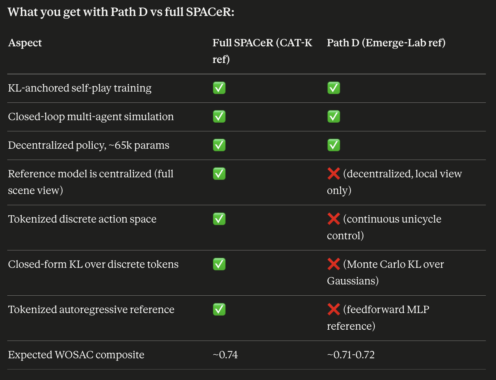

# SPACeR Reproduction Plan

> No official SPACeR code exists. This is a from-scratch reimplementation
> guided by the paper, reusing **GPUDrive** as the sim and **CAT-K/SMART** as
> the frozen reference π_ref. Hardware: single **RTX 3060 12 GB**.

## Chosen approach: Strategy A (validated)

**Use the public CAT-K `clsft_E9` checkpoint as π_ref** (frozen, forward-only).

- Agent token vocabulary is **fixed at 2048** — verified 3 ways
  (`token_processor.py:49`; checkpoint `token_predict_head` out_features=2048;
  `agent_vocab_555_s2.pkl` → `(2048,6,4,2)` per class). The `555`/`200` numbers
  are **not** the vocab size (`555` = filename label; `200` = the *paper's own*
  trained reference, a different artifact).
- π_θ's action head **and** the Eq. 5 KL sum must both be **2048**. The
  vocabulary cannot be shrunk/filtered without retraining π_ref.
- Strategy B (train your own tiny K=50/100 reference, 0.3M params — paper
  Table R1 shows even a weak reference works) remains a valid *fallback* if
  Strategy A's fidelity proves insufficient, but is **not** the current path.

## Loss design: Variant 4 (KL + r_inf) — paper-validated default

Per Table A2 (paper appendix) the only load-bearing anchoring term is the KL
(Eq. 5); the LLH reward (Eq. 3) adds no composite gain on top of KL, and the
goal-reward channel is also droppable ("goals unnecessary"). We adopt
**Variant 4 ("KL + r_inf")** — Table A2's best composite (0.74) with the
fewest tunables:

```
Loss(θ) = − L_PPO( r_inf )  +  β · KL(π_θ ‖ π_ref)
  r_inf  = −0.75·𝟙[collision] − 0.75·𝟙[off-road]   (no goal channel)
  α = 0     ⇒ LLH dropped
  w_goal = 0
```

Wired in `spacer/train_spacer.py`: `build_env` sets the EnvConfig reward
weights (`goal_achieved_weight=0`, `collision_weight=-0.75`,
`off_road_weight=-0.75`, `reward_type="weighted_combination"`) and `run(...)`
defaults `alpha=0.0`. Only β remains as the anchoring scalar to tune (see
M5e sweep). See [Architecture.md](Architecture.md#loss-summary-eqs-1-2-3-5--variant-4-chosen-as-default)
for the full variant table.

## Paper mapping (what each piece implements)

SPACeR (Sec 3, Eqs 1–5): decentralized self-play **π_θ** in a tokenized action
space, anchored to a centralized frozen tokenized **π_ref** via a KL term
(Eq. 5) + log-likelihood reward (Eq. 3); trained with `L = L_PPO − β·D_KL`
(Eq. 2), reward `r = r_task + α·r_humanlike` (Eq. 1). **Our chosen reduction
(see above) sets α=0 and w_goal=0 (Variant 4).**

| Component | Paper element | Status |
|---|---|---|
| Env coexistence (catk-spacer image, RTX 3060) | infra | ✅ |
| π_ref = `clsft_E9` loads, 2048-head | Sec 3.2 reference model | ✅ Test 1 |
| GPUDrive sim + policy rollout | self-play env | ✅ Test 2 |
| **GPUDrive→SMART adapter** (π_ref scores sim state) | enables Eq. 3 & 5 (paper-required, unreleased) | ✅ Tests 3–5 |
| **M1 token→state driver** | Sec 4.1 tokenized trajectory action space | ✅ exact (decode 0.00 err; state-driver exact) |
| **M2 π_θ 2048-token head** | the policy π_θ | ▶ next |
| **M3 Eq. 5 KL + Eq. 3** | SPACeR's central contribution | ⏳ |
| **M4 PPO+KL loop (Eq. 2/1)** | the SPACeR algorithm | ⏳ |
| **M5 scale tuning** | reproduction | ⏳ |

Layers: (1) paper-required plumbing the paper didn't release — adapter, M1, M2
[in progress]; (2) the headline equations — M3, M4; (3) scale — M5.

## Stage/gate detail

Full per-stage deliverables + binary PASS/FAIL gate criteria + on-fail actions:
**[spacer/STAGE_PLAN.md](spacer/STAGE_PLAN.md)**.

Evaluation (M6) is broken out separately: **[Eval_Plan.md](Eval_Plan.md)** —
phased quick-internal → full WOSAC, two-container architecture, WOMD download
checklist.

Training configuration (paper-extracted setup, our deviations, 3060
feasibility, recommended run config): **[Training_Config.md](Training_Config.md)**.

## Remaining milestones

- **M2 — π_θ token policy.** Reuse GPUDrive late-fusion MLP backbone (~65k
  params); swap the 91-way accel/steer head for a **2048-way categorical** over
  the agent-token vocab on GPUDrive local obs. Test: random-init forward →
  valid 2048 categorical; sampled tokens decode via the M1 driver.
- **M3 — Eq. 5 + Eq. 3 (the validation gate).** Wire closed-form
  `D_KL(π_θ‖π_ref) = Σ_{2048} π_θ log(π_θ/π_ref)` and
  `r_humanlike = log π_ref(a_t|s_t)` at the 0.5 s / 5 Hz cadence (sim 10 Hz).
  Re-run the Test-5 contrast: **this is where SPACeR's dominant signal (KL) is
  validated on this stack** — Test 5 showed token-NLL (Eq. 3) is the weak
  lever; KL is the claimed strong one but is *unverified here*. Genuine
  research checkpoint, not just implementation.
- **M4 — PPO+KL loop (Eq. 2).** Adapt GPUDrive PufferLib PPO; add `−β·D_KL`
  and `α·r_humanlike`; scaled-down run on the 3060 (few worlds, short).
- **M5 — scale tuning** within 12 GB.

## Training budget guidance — Fig A1 knee analysis (run-sizing reference)

Derived by inspecting paper Fig A1(b) (β sweep, α=0 — the panel that exactly
matches Variant 4). Use this section to size any long training run.

Assumed axis: **linear, 0 → 1×10⁹ env-steps** (no intermediate decade labels
in the figure; curve shapes consistent with linear, not log — confirmed by
zooming the rendered PDF). Knee = where the rapid initial transient gives
way to the slow plateau.

**Where the knee falls in the paper's plots:**

| β curve | Knee location (rough fraction of x range) | Approx env-steps |
|---|---|---|
| β=1.0 | ~5% — drops fastest | ~5×10⁷ |
| **β=0.1 (our config)** | ~5–10% | **~5–10×10⁷** |
| β=0.01 | ~10–15% | ~1×10⁸ |
| β=0.0 | barely descends — no real knee | — |

A knee is visible across all anchored configurations between **2×10⁷ and
1×10⁸ env-steps**. 1×10⁸ is conservative; an earlier inflection appears by
~2–3×10⁷.

**Translating to our 3060 budget** (Test 14 baseline: 7.17×10⁵ env-steps in
23 min at W=32, ≈ 0.14 it/s):

| Target | env-steps | × Test 14 | Iters @ W=32 | Wall time |
|---|---|---|---|---|
| Start of knee (curves visibly bend) | 2×10⁷ | 28× | ~5,600 | **~11 h** (overnight) |
| Full knee passed (rapid descent over) | 5×10⁷ | 70× | ~14,000 | ~28 h (≈ 1.2 days) |
| Curves clearly plateauing | 1×10⁸ | 140× | ~28,000 | ~55 h (≈ 2.3 days) |
| Paper's full training | 1×10⁹ | 1400× | ~280,000 | ~22 days (out of reach) |

**Recommended minimum to see a major trend: ~2×10⁷ env-steps → ~5,000 iters
at W=32 → ~11 h, overnight feasible.** That's the cheapest run that should
produce a visible curve shape comparable to Fig A1's early descent — not the
settled plateau, but enough trajectory to extrapolate from.

**Caveat on the "knee" comparison:** Test 14 already shows a knee at iter
50–100 (≈ 2–7×10⁵ env-steps) in just 23 min. That's *our* knee — likely
because random-init π_θ has more headroom to anchor than the paper's
warmer-started initialization (paper's curves start at D_KL ≈ 2.5, ours at
≈ 5.66). What we *haven't* traced is the slow-tail descent from KL ≈ 0.9
down to ≈ 0.5 that the paper shows between 5×10⁷ and 1×10⁹ env-steps —
reaching meaningfully into that tail is what an overnight run actually
buys, and the 2×10⁷-step target is the first step into it.

## Honest caveats

- **3060 scale ceiling.** Paper: 1B steps on A100, 1–2 days. The 3060 gets a
  *scaled-down* run — pipeline will run; paper-grade numbers will not be
  matched. Known from the start.
- **M3 is a real gate**, not a foregone conclusion: the KL-is-the-strong-signal
  claim is assumed from the paper, not yet verified on GPUDrive+CAT-K.
- **Adapter fidelity headroom** (best-effort map type-enum table, traffic-light
  defaulted, polyline grouping). Test 4 NLL 3.46 is strong/usable but not
  ideal; refinable, not blocking. Could blunt M3's KL signal — watch at M3.
- **Adapter is reproduction-extra**: the paper trained its own GPUDrive-aligned
  reference (no adapter needed); bridging public CAT-K is a faithful but
  paper-undocumented substitution.
- **Appendix A.4 (SMART/CAT-K training) is skipped entirely** — that's the
  point of Strategy A (use Zhejun's `clsft_E9`). Consequences:
  - (a) Our π_ref is CAT-K's **flagship SMART-tiny-7M** (`smart.yaml`
    `method_name: "SMART-tiny-CLSFT"`; `clsft_E9` = its CAT-K-CLSFT stage —
    the **WOSAC #1** model, RMM 0.7702, 2048-token vocab). It is **not** the
    SPACeR paper's *own* A.4 reference (the SPACeR paper trained/ablated its
    own 0.3M/1M/3M references). So our reference is a legitimate substitute
    that is **stronger, not weaker**, than the paper's own — the substitution
    is biased *upward* in quality; SPACeR robustness to reference quality
    (Table R1) makes this sound. "SMART-tiny-CLSFT" is CAT-K's official model
    name, not a placeholder.
  - (b) A.4's **5 Hz** control rate is **not** attainable out-of-the-box — the
    fixed public checkpoint is tokenized at `shift=5` → 0.5 s, so the default
    SPACeR loop runs at the checkpoint-native **2 Hz** token cadence (coarser
    control than the paper). Recoverable via **optional Stage S2.5** (5 Hz
    reference distilled from `clsft_E9`), gated on the S5/M4 reactivity
    diagnostic — see `spacer/STAGE_PLAN.md`. Cadence invariant: Eq. 5's
    closed-form KL needs π_θ and π_ref on the *same* action space *and*
    cadence, so 5 Hz requires a new 5 Hz *reference*, not just a faster policy.
  - (c) **Reactivity / `r_task` event-detection: RESOLVED (Test 11).** Earlier
    M5c saw `r_task = 0`; the diagnostic (`spacer/test_rtask_diagnostic.py`)
    proved (i) `state`-dynamics does NOT bypass collision/off-road detection,
    (ii) `collision_behavior="ignore"` does NOT zero the penalty, but (iii)
    `ignore` is **edge-triggered** (one-step penalty per event). Fix:
    `train_spacer.build_env` now uses `collision_behavior="stop"`
    (level-triggered, sustained penalty ⇒ clear RL gradient). The S2.5 trigger
    is **not** event-detection-related; whether 2 Hz is cadence-sluggish at
    scale is the remaining (untested) S2.5 trigger — only checkable via a
    longer run on the fixed config.


