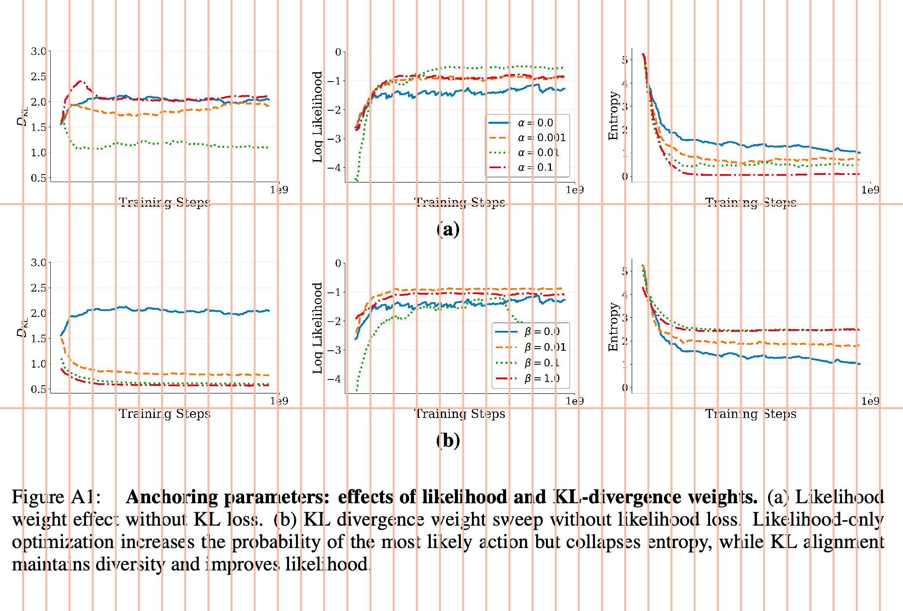
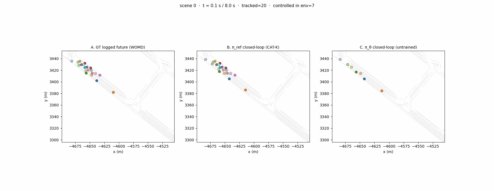
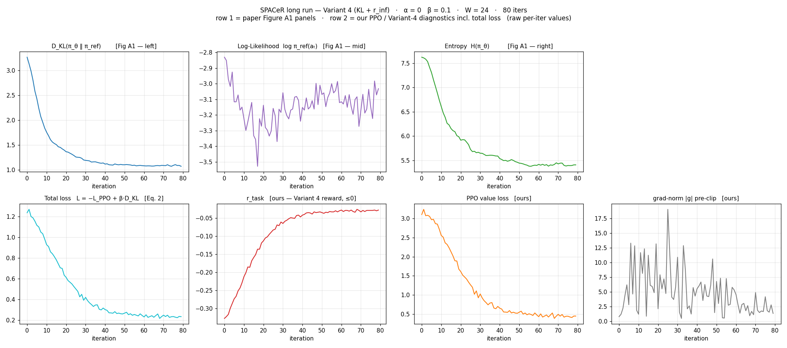
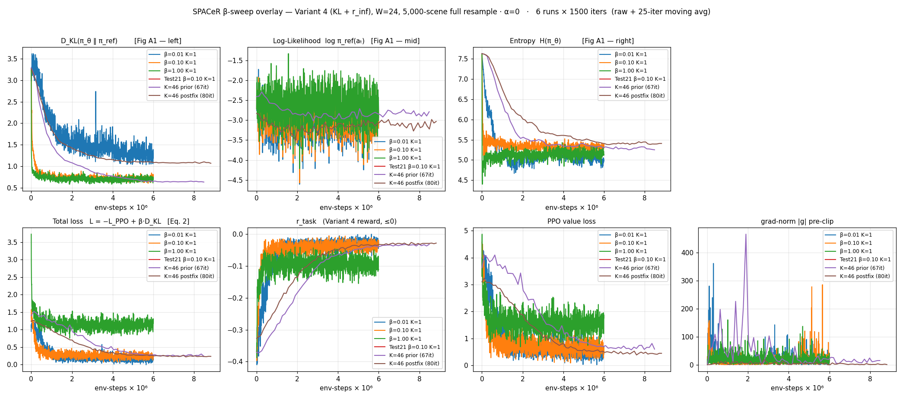

# SPACeR — reproduction notes

Reproduction of SPACeR (KL-anchored PPO on top of a behavior-cloned policy) in
GPUDrive / Waymo Open Motion. The goal is the paper's Figure A1 training
dynamics and Table 1 evaluation columns.

## Latest updates

- The teacher works well but the student doesn't seem to be learning much. 
- The reward signal needs further investigation. 
- Student is off. 
- Missing the 2Hz signal
- Even after gradient accumulation, the loss updates are not good enough to cover the paper
- Plateaues happen much earlier in our study compared to paper, even when using 10K samples with 200 new injections. 
- Paper plateaus are at 1E7. 




## Latest runs at a glance

**Completed run:** K=46 rollout-accumulation, β=0.10, W=24, 80 iters, 10k-scene
training set. Wall time ≈ 8 h 43 m. Verdict line: *M5b OK — faithful loop
(exact per-agent Eq.5, differentiable), stable, π_θ updates*.

### Per-iter curves (completed K=46 run)



Layout mirrors the paper's Figure A1: row 1 = D_KL / log-likelihood / entropy,
row 2 = PPO diagnostics (total loss, r_task, value loss, grad-norm |g|).

Headline trajectory (start → end):

| | it=00 | it=09 | it=50 | it=79 |
|--|--|--|--|--|
| r_task | −0.327 | −0.229 | −0.030 | **−0.028** |
| KL | 3.268 | 1.843 | 1.094 | **1.072** |
| r_h | −2.831 | −3.150 | −3.000 | −3.032 |
| H | 7.625 | 6.742 | 5.382 | 5.408 |
| \|g\| | 0.80 | 1.89 | 7.27 | 1.35 |

### Env-step overlay (β-sweep + K=46 runs)



Six runs overlaid on an env-step x-axis so the K=1 β-sweep (β=0.01 / 0.10 /
1.00) is comparable to the K=46 rollout-accumulation runs. Most visible
contrast is in the **grad-norm panel** (bottom-right): the K=46 *postfix* run
sits 30–40× lower than the prior K=46 partial and the bsweep runs — gradient
clipping is no longer truncating PPO updates.

## What the "rollout-fidelity" fixes did and didn't do

The audit-driven fixes (commit `92b047e`) targeted gradient computation and
scaling. Mechanically they worked:

| | Prior K=46 (it=67) | Postfix K=46 (it=80) |
|--|--|--|
| \|g\| pre-clip | 50 – 200 | **1 – 7** |
| KL settling | 0.65 | 1.08 |
| r_task settling | −0.034 | −0.028 |

But the policy **converges to essentially the same equilibrium** — same r_task
plateau, same entropy collapse, same r_h drift. The cleaner gradients let π_θ
roam *further* from the BC anchor (KL 0.65 → 1.08) without translating to a
meaningfully better task reward.

The bottleneck isn't gradient quality. It's the reward function: r_task only
penalizes collision and off-road, with no positive signal for progress. The
global optimum is "don't move." The previous K=46 / it=50 eval showed exactly
this failure mode:

```
goal_rate         0.0137  vs  0.2926 (π_ref)
min_ade_m        28.23    vs   4.21   (π_ref)
collision_rate    0.058   vs   0.073  (π_ref)   ← marginally better than ref
off_road_rate     0.038   vs   0.258  (π_ref)   ← much better
```

Safe-but-degenerate. The cleaner gradients give a better solver for the same
wrong problem.

## Reproducing the plots

```bash
# per-iter curves
python3 spacer/plot_curves.py <run.log> plots/<out>.png

# multi-run overlay (env-step x-axis if all runs pass spi)
python3 spacer/plot_compare.py plots/<out>.png \
    "label1:spacer/logs/run_A.log:<samples_per_iter>" \
    "label2:spacer/logs/run_B.log:<samples_per_iter>"
```

`samples_per_iter` is `T × N_agents × K` (printed by training as
`[scale] samples/update=...`). For K=1 bsweep runs use ≈ 4000; for K=46
runs use the value from the run log (≈ 111712 for the postfix run).
